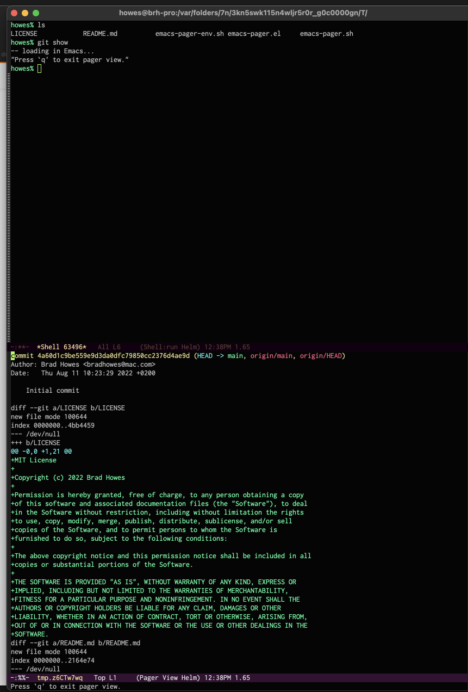

# emacs-pager

Use Emacs to display pager-like output from shells run inside the same Emacs host.



This repo contains components that work together to get this to work. First, you are using Emacs and you enjoy
spawning shell processes within Emacs to do work within an Emacs environment.

* [emacs-pager.el](emacs-pager.el) -- Emacs lisp file that defines a simple command and buffer mode to show the
  pager output.
* [emacs-pager.sh](emacs-pager.sh) -- Simple Bash shell script that saves content to a temporary file for Emacs
  to use to show in a new buffer.
* [emacs-pager-env.sh](emacs-pager-env.sh) -- Example of how to setup your shell environment to have Emacs be
  your pager for commands like `git` or `man`.

# Emacs Installation and Configuration

You will need to put `emacs-pager.el` in a location where your Emacs process can find it, and then have Emacs
load it at startup. You will also need to start Emacs server so that it can respond to `emacsclient` requests:

```
(require 'emacs-pager)
(require 'server)
(unless server-running-p
  (server-start))
```

Additionally, you probably want to make sure that any shell subprocess you create via `M-x shell` has the right
environment settings, so something like this might desired in your Emacs startup file:

```
(setq explicit-bash-args '("--login" "-i"))
(setq explicit-zsh-args '("--login" "-i"))
```

# Shell Installation and Configuration

You will need to put the `emacs-pager.sh` someplace in your `PATH` and make it executable. For instance, if you
have the directory `$HOME/bin` in your `PATH` environment, you could do the following:

```
% cp emacs-pager.sh ~/bin/emacs-pager
% chmod a+x ~/bin/emacs-pager
```

Finally, you need to update your shell's interactive configuration file to use `emacs-pager` for paging duties
when running inside a shell in Emacs. The file `emacs-pager-env.sh` contains a way to do so that has worked for
me.
